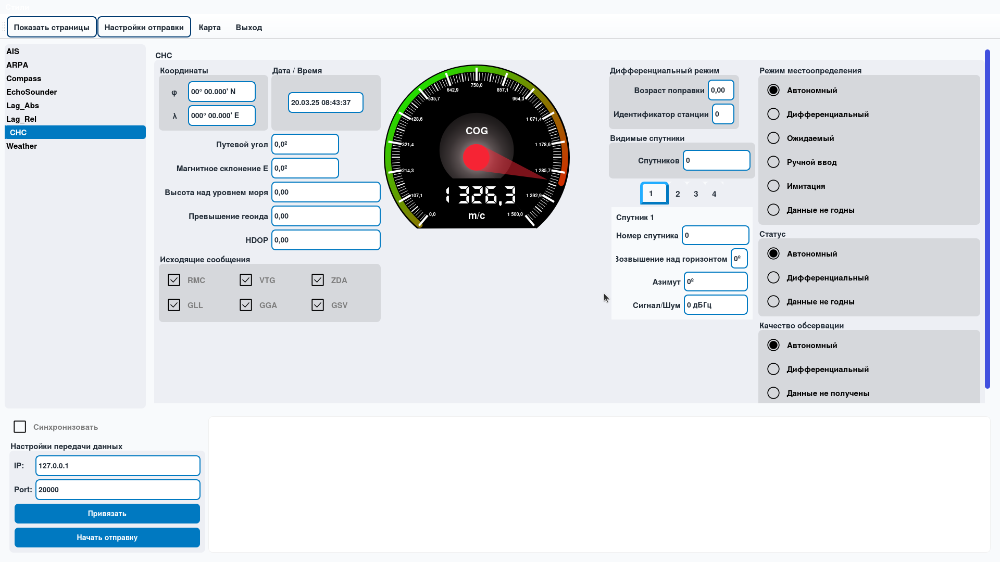
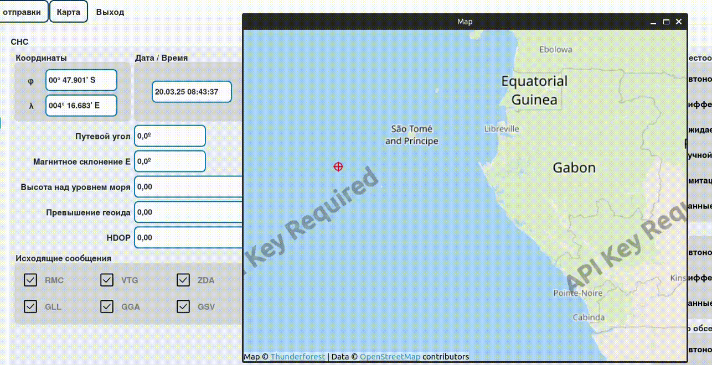

<link href="https://fonts.googleapis.com/css2?family=Goblin One&display=swap" rel="stylesheet">
<p align="center">
  
  <br><br>
  <strong>
    <span style="font-size: 64px; background: linear-gradient(90deg, #3F9DBF, #82D7F4); -webkit-background-clip: text; -webkit-text-fill-color: transparent; font-family: Goblin One;  letter-spacing: 5px;">
      Lazuli
    </span>
  </strong>
</p>

<!-- Языки -->
<!-- Языки -->
<p align="center" style="font-size: 16px;">
  <strong style="font-size: 18px;">Язык:</strong><br>
  <a href="README.md" style="font-size: 16px; text-decoration: none; margin: 0 5px;">🇬🇧</a> • 
  <a href="gitRes/README_ru.md" style="font-size: 16px; text-decoration: none; margin: 0 5px;">🇷🇺</a>
</p>

<!-- Навигационное меню -->
<p align="center" style="font-size: 16px;">
  <strong style="font-size: 18px;">Навигация:</strong><br>
     <a href="#описание">Описание</a> • 
     <a href="#функции">Функции</a> • 
     <a href="#установка">Установка</a> • 
     <a href="#ссылки">Ссылки</a> • 
     <a href="#контрибуторы ">Контрибуторы </a><br>
    <a href="https://github.com/users/Jomart02/projects/1"">
    Roadmap
  </a>
</p>

## Описание
Lazuli — это многофункциональный симулятор сообщений NMEA, предназначенный для генерации предложений NMEA в целях тестирования, разработки и обучения. Он передает данные через UDP, а в будущем планируется поддержка коммуникации через последовательный (COM) порт.

Lazuli выделяется своей архитектурой на основе плагинов, что позволяет пользователям расширять его функциональность и легко добавлять пользовательские симуляторы или новые типы сообщений NMEA.

## Функции
### Система плагинов для расширения:
Lazuli включает мощную систему плагинов, предоставляющую пользователям возможность расширять его возможности путем разработки собственных плагинов. Эти плагины могут добавлять новые генераторы предложений NMEA, симулировать конкретные сценарии или интегрировать сторонние инструменты, обеспечивая гибкость и адаптивность приложения к меняющимся потребностям.

[Базовый класс плагина](https://github.com/Jomart02/BaseNaviWidget/tree/11d4991ce9b7591ce461af3f34f1f4f94c38ff8c) предоставляет возможность описать плагин и самостоятельно отправляет все сообщения.

Для реализации генерации сообщений NMEA необходимо переопределить один метод.

Программа создает папку Plugins (Lazuli/Plugins) в домашней директории пользователя.

Плагины (наследники базового класса) должны быть размещены в этой директории.

### Настраиваемые симуляции

Пользователи могут настраивать профили симуляции для воспроизведения реальных условий, таких как движение судна, погодные данные, показания датчиков и многое другое. Эта возможность настройки позволяет разработчикам и тестировщикам проверять свои системы в разнообразных и контролируемых условиях.



### Настройка стилей с помощью QSS

Lazuli поддерживает таблицы стилей Qt (QSS) и [StyleManager](https://github.com/Jomart02/QssStyleManager/tree/5899cc2385e98501828e1226899dd6fa04698501), что позволяет пользователям полностью настраивать внешний вид приложения с использованием пользовательских настроек.

Программа создает папку Styles (Lazuli/Styles) в домашней директории пользователя.

В эту директорию можно поместить настройки стилей в формате JSON (они должны соответствовать формату стилей Lazuli).

### Координаты на карте

Программа позволяет получать координаты с карты.

При клике на карту широта и долгота передаются в виртуальный метод базового класса.


---
Lazuli разработан с использованием C++ и модуля QtWidgets библиотеки Qt 6.5.3, что обеспечивает высокую производительность и кроссплатформенную совместимость.

## Установка 
Clone this repo and update submodules

```shell
git submodule update --init --recursive
```
```shell
mkdir build
cd build && cmake ..
cmake --build . -j 8 --config Release 
```

## Ссылки
- [Plugins](https://github.com/Jomart02/NavySimulators)
- [StyleManager](https://github.com/Jomart02/QssStyleManager/tree/5899cc2385e98501828e1226899dd6fa04698501)
- [The base plugin class](https://github.com/Jomart02/BaseNaviWidget/tree/11d4991ce9b7591ce461af3f34f1f4f94c38ff8c)
- [using NMEA message](https://gpsd.gitlab.io/gpsd/NMEA.html)
- [AIS](https://gpsd.gitlab.io/gpsd/AIVDM.html)

## Контрибуторы 

- с++, python middle developer [pandazz77](https://github.com/pandazz77)
- c++, mobile app developer , designer [Tatarin](https://github.com/Tatarin61866) 